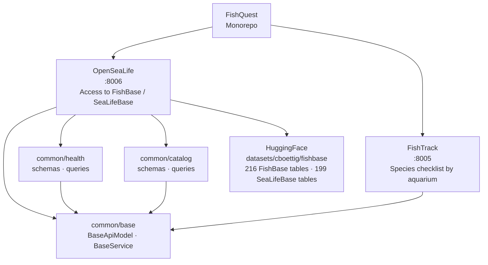

# FishQuest

Monorepo of APIs for accessing and tracking aquatic species data.

## Architecture



## APIs

| API | Port | Description |
|---|---|---|
| [OpenSeaLife](apis/OpenSeaLife/README.md) | `8006` | Centralizes access to FishBase and SeaLifeBase via HuggingFace |
| [FishTrack](apis/FishTrack/README.md) | `8005` | Species checklist by aquarium |

## Structure

```
FishQuest/
├── apis/
│   ├── common/          # Shared schemas and queries across APIs
│   │   ├── base/        # BaseApiModel and BaseService
│   │   ├── health/      # Domain: health checks
│   │   └── catalog/     # Domain: table discovery
│   ├── OpenSeaLife/     # FishBase/SeaLifeBase access API
│   └── FishTrack/       # Species checklist API
└── docs/                # User story documentation
```

## Commands (monorepo)

```bash
make run-opensealife   # Start OpenSeaLife on :8006
make run-fishtrack     # Start FishTrack on :8005
make install           # Install dependencies for both APIs
make lint              # ruff check across the monorepo
make format            # ruff format across the monorepo
make typecheck         # mypy across the monorepo
```
