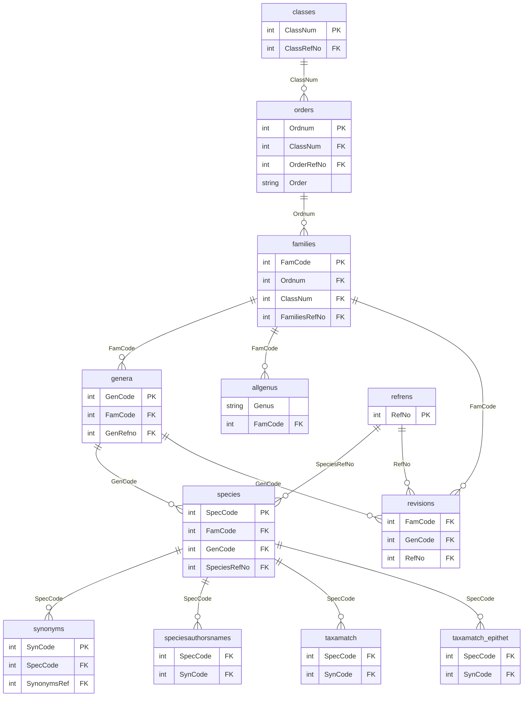
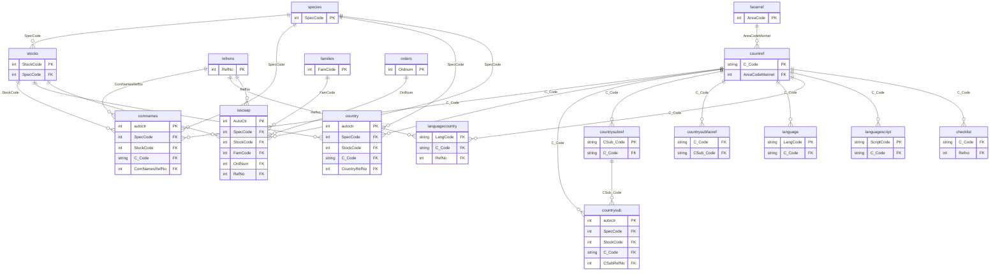

# FishBase ER Diagrams — cboettig/fishbase (v25.04)

[FishBase](https://www.fishbase.org) es la base de datos de referencia mundial sobre peces. Este repositorio consume el dataset `cboettig/fishbase` en HuggingFace, que distribuye 216 tablas de FishBase como archivos Parquet individuales en `data/fb/v25.04/parquet/`.

Este documento describe el esquema entidad-relación de ese dataset, organizado en 10 dominios temáticos.

---

## Claves centrales del esquema

| Campo | Tabla propietaria | Rol |
|---|---|---|
| `SpecCode` | `species` | PK central — identificador único de especie, referenciado por ~150 tablas |
| `StockCode` | `stocks` | PK de stock — subdivisión poblacional de especie, referenciado por ~80 tablas |
| `FamCode` | `families` | PK de familia taxonómica |
| `GenCode` | `genera` | PK de género taxonómico |
| `Ordnum` | `orders` | PK de orden taxonómico (campo `Order` es texto, no clave numérica) |
| `ClassNum` | `classes` | PK de clase taxonómica |
| `C_Code` | `countref` | PK de país/región (código ISO-like) |
| `RefNo` | `refrens` | PK de referencia bibliográfica |
| `AreaCode` | `faoarref` | PK de área FAO |
| `E_CODE` | `ecosystemref` | PK de ecosistema |
| `DietCode` | `diet` | PK de registro de dieta (referenciado por `diet_items`) |
| `LFCode` | `poplf` | PK de distribución de tallas (referenciado por `poplfdata`) |
| `FishCode` | `fl_fish` | PK en sub-dataset Food Loss |
| `DisCode` | `disref` | PK del catálogo de enfermedades |
| `AqCode` | `aquariumref` | PK de directorio de acuarios |
| `OccurrenceRefNo` | `occurrence` | PK semántica de ocurrencias — referenciada por `museum` y `collectionsref` |

---

## Convención de lectura

- Cada diagrama muestra solo columnas **PK** y **FK** por tabla (no todas las columnas).
- Las entidades hub (`species`, `stocks`, `refrens`, `countref`, etc.) se repiten en cada diagrama con solo su PK para dar contexto.
- Cardinalidad `||--o{` = uno-a-muchos.
- La etiqueta de cada relación es el nombre del campo FK en la tabla origen.

---

### D1 — Taxonomía central

---

### D2 — Nombres comunes y referencias de país

---

### D3 — Geografía y distribución

```mermaid
erDiagram
    species {
        int SpecCode PK
    }
    stocks {
        int StockCode PK
        int SpecCode FK
        int StocksRefNo FK
    }
    faoarref {
        int AreaCode PK
    }
    countref {
        string C_Code PK
    }
    ecosystemref {
        int E_CODE PK
    }
    refrens {
        int RefNo PK
    }
    families {
        int FamCode PK
    }
    orders {
        int Ordnum PK
        string Order
    }
    faoareas {
        int autoctr PK
        int SpecCode FK
        int StockCode FK
        int AreaCode FK
    }
    faoarfam {
        int FamCode FK
        int AreaCode FK
    }
    faoarord {
        string Order FK
        int AreaCode FK
    }
    faocatch {
        int autoctr PK
        string C_Code FK
        int AreaCode FK
    }
    faoaquacult {
        int autoctr PK
        string C_Code FK
        int AreaCode FK
    }
    icescatch {
        int AutoCtr PK
        string C_Code FK
    }
    countfao {
        int autoctr PK
        int SpecCode FK
        int StockCode FK
        string C_Code FK
        int AreaCode FK
    }
    countfaoref {
        string C_Code FK
        int AreaCode FK
    }
    occurrence {
        int OccurrenceRefNo PK
        int SpecCode FK
        int Stockcode FK
        string C_Code FK
    }
    intrcase {
        int autoctr PK
        int SpecCode FK
        int StockCode FK
        int IntrCaseRefNo FK
        string C_Code_To FK
    }
    ecosystem {
        int autoctr PK
        int E_CODE FK
        int Speccode FK
        int Stockcode FK
        int EcosystemRefno FK
    }
    ecosystemcountry {
        int autoctr PK
        int E_CODE FK
        string C_Code FK
        int Speccode FK
        int Stockcode FK
    }
    countecosystem {
        int autoctr PK
        int E_CODE FK
        string C_Code FK
        int Speccode FK
    }
    ecosysfam {
        int E_CODE FK
        int FamCode FK
    }
    ecosystemfaoref {
        int E_CODE FK
        int AreaCode FK
    }
    ecosystemcntref {
        int E_CODE FK
        string C_CODE FK
    }
    ecosyslhref {
        int E_CODE FK
    }
    oceanprovinces {
        int StockCode FK
        int SpecCode FK
        int ProvinceRef FK
    }
    oceanprovfaoref {
        int AreaCode FK
        int RegionNo
    }
    gazetteer {
        int GazetCode PK
        string C_CODE FK
        int AreaCodeMarine FK
    }
    bruvssurvey {
        int ExpeditionID PK
        string C_Code FK
        int E_Code FK
        int AreaCode FK
    }
    bruvssample {
        int SampleID PK
        int ExpeditionID FK
    }
    bruvsspecies {
        int RecordID PK
        int SampleID FK
        int FamCode FK
        int Speccode FK
    }

    species ||--o{ stocks : "SpecCode"
    species ||--o{ faoareas : "SpecCode"
    stocks ||--o{ faoareas : "StockCode"
    faoarref ||--o{ faoareas : "AreaCode"
    families ||--o{ faoarfam : "FamCode"
    faoarref ||--o{ faoarfam : "AreaCode"
    orders ||--o{ faoarord : "Order"
    faoarref ||--o{ faoarord : "AreaCode"
    countref ||--o{ faocatch : "C_Code"
    faoarref ||--o{ faocatch : "AreaCode"
    countref ||--o{ faoaquacult : "C_Code"
    faoarref ||--o{ faoaquacult : "AreaCode"
    countref ||--o{ icescatch : "C_Code"
    species ||--o{ countfao : "SpecCode"
    stocks ||--o{ countfao : "StockCode"
    countref ||--o{ countfao : "C_Code"
    faoarref ||--o{ countfao : "AreaCode"
    countref ||--o{ countfaoref : "C_Code"
    faoarref ||--o{ countfaoref : "AreaCode"
    species ||--o{ occurrence : "SpecCode"
    stocks ||--o{ occurrence : "Stockcode"
    countref ||--o{ occurrence : "C_Code"
    species ||--o{ intrcase : "SpecCode"
    stocks ||--o{ intrcase : "StockCode"
    refrens ||--o{ intrcase : "IntrCaseRefNo"
    countref ||--o{ intrcase : "C_Code_To"
    ecosystemref ||--o{ ecosystem : "E_CODE"
    species ||--o{ ecosystem : "Speccode"
    stocks ||--o{ ecosystem : "Stockcode"
    refrens ||--o{ ecosystem : "EcosystemRefno"
    ecosystemref ||--o{ ecosystemcountry : "E_CODE"
    countref ||--o{ ecosystemcountry : "C_Code"
    species ||--o{ ecosystemcountry : "Speccode"
    ecosystemref ||--o{ countecosystem : "E_CODE"
    countref ||--o{ countecosystem : "C_Code"
    species ||--o{ countecosystem : "Speccode"
    ecosystemref ||--o{ ecosysfam : "E_CODE"
    families ||--o{ ecosysfam : "FamCode"
    ecosystemref ||--o{ ecosystemfaoref : "E_CODE"
    faoarref ||--o{ ecosystemfaoref : "AreaCode"
    ecosystemref ||--o{ ecosystemcntref : "E_CODE"
    countref ||--o{ ecosystemcntref : "C_CODE"
    ecosystemref ||--o{ ecosyslhref : "E_CODE"
    stocks ||--o{ oceanprovinces : "StockCode"
    species ||--o{ oceanprovinces : "SpecCode"
    refrens ||--o{ oceanprovinces : "ProvinceRef"
    faoarref ||--o{ oceanprovfaoref : "AreaCode"
    countref ||--o{ gazetteer : "C_CODE"
    faoarref ||--o{ gazetteer : "AreaCodeMarine"
    countref ||--o{ bruvssurvey : "C_Code"
    ecosystemref ||--o{ bruvssurvey : "E_Code"
    faoarref ||--o{ bruvssurvey : "AreaCode"
    bruvssurvey ||--o{ bruvssample : "ExpeditionID"
    bruvssample ||--o{ bruvsspecies : "SampleID"
    families ||--o{ bruvsspecies : "FamCode"
    species ||--o{ bruvsspecies : "Speccode"
```

---

### D4 — Ecología y alimentación

```mermaid
erDiagram
    species {
        int SpecCode PK
    }
    stocks {
        int StockCode PK
    }
    refrens {
        int RefNo PK
    }
    countref {
        string C_Code PK
    }
    ecosystemref {
        int E_CODE PK
    }
    ecology {
        int autoctr PK
        int SpecCode FK
        int StockCode FK
        int EcologyRefNo FK
    }
    diet {
        int DietCode PK
        int StockCode FK
        int Speccode FK
        int DietRefNo FK
        string C_Code FK
        int E_Code FK
    }
    diet_items {
        int autoctr PK
        int DietCode FK
        int DietSpeccode FK
    }
    fooditems {
        int autoctr PK
        int StockCode FK
        int SpecCode FK
        string C_Code FK
        int FoodsRefNo FK
        int PreySpecCode FK
    }
    food {
        int AutoCtr PK
        int Refno FK
    }
    foodtroph {
        int RefNo FK
    }
    predats {
        int autoctr PK
        int StockCode FK
        int SpecCode FK
        string C_Code FK
        int PredatsRefNo FK
    }
    ration {
        int AutoCtr PK
        int StockCode FK
        int SpecCode FK
        int RDRefNo FK
        string C_Code FK
    }
    globi {
        int SpecCode FK
    }
    homerange {
        int HomeRangeID PK
        int Speccode FK
        int Stockcode FK
        int HomeRangeRefno FK
    }
    gomexsi {
        int speccode FK
    }
    alieninvasive {
        int Autoctr PK
        int Speccode FK
    }
    aquamaps {
        int speccode FK
    }

    species ||--o{ ecology : "SpecCode"
    stocks ||--o{ ecology : "StockCode"
    refrens ||--o{ ecology : "EcologyRefNo"
    species ||--o{ diet : "Speccode"
    stocks ||--o{ diet : "StockCode"
    refrens ||--o{ diet : "DietRefNo"
    countref ||--o{ diet : "C_Code"
    ecosystemref ||--o{ diet : "E_Code"
    diet ||--o{ diet_items : "DietCode"
    species ||--o{ diet_items : "DietSpeccode"
    species ||--o{ fooditems : "SpecCode"
    stocks ||--o{ fooditems : "StockCode"
    countref ||--o{ fooditems : "C_Code"
    refrens ||--o{ fooditems : "FoodsRefNo"
    species ||--o{ fooditems : "PreySpecCode"
    refrens ||--o{ food : "Refno"
    refrens ||--o{ foodtroph : "RefNo"
    species ||--o{ predats : "SpecCode"
    stocks ||--o{ predats : "StockCode"
    countref ||--o{ predats : "C_Code"
    refrens ||--o{ predats : "PredatsRefNo"
    species ||--o{ ration : "SpecCode"
    stocks ||--o{ ration : "StockCode"
    refrens ||--o{ ration : "RDRefNo"
    countref ||--o{ ration : "C_Code"
    species ||--o{ globi : "SpecCode"
    species ||--o{ homerange : "Speccode"
    stocks ||--o{ homerange : "Stockcode"
    refrens ||--o{ homerange : "HomeRangeRefno"
    species ||--o{ gomexsi : "speccode"
    species ||--o{ alieninvasive : "Speccode"
    species ||--o{ aquamaps : "speccode"
```

---

### D5 — Dinámica poblacional

```mermaid
erDiagram
    species {
        int SpecCode PK
    }
    stocks {
        int StockCode PK
    }
    refrens {
        int RefNo PK
    }
    countref {
        string C_Code PK
    }
    ecosystemref {
        int E_CODE PK
    }
    families {
        int FamCode PK
    }
    popgrowth {
        int AutoCtr PK
        int StockCode FK
        int SpecCode FK
        int E_CODE FK
        int PopGrowthRef FK
        string C_Code FK
    }
    popchar {
        int Autoctr PK
        int Speccode FK
        int Stockcode FK
        int PopCharRefNo FK
        string C_Code FK
    }
    poplw {
        int AutoCtr PK
        int StockCode FK
        int SpecCode FK
        int FamCode FK
        int PopLWRef FK
        string C_Code FK
    }
    poplf {
        int LFCode PK
        int Stockcode FK
        int Speccode FK
        int LFRefno FK
        string C_Code FK
    }
    poplfdata {
        int autoctr PK
        int LFCode FK
    }
    popll {
        int autoctr PK
        int StockCode FK
        int SpecCode FK
    }
    popqb {
        int AutoCtr PK
        int StockCode FK
        int SpecCode FK
        int PopQBRefNo FK
        string C_Code FK
    }
    pop_r {
        int AutoCtr PK
        int StockCode FK
        int SpecCode FK
        int POP_r_Ref FK
    }
    pop_rm {
        int AutoCtr PK
        int StockCode FK
        int SpecCode FK
        int PopRMRef FK
    }
    popular {
        int Speccode FK
    }
    estimate {
        int SpecCode FK
    }
    matrix {
        int ID PK
        int SpecCode FK
        int FamCode FK
        int stockcode FK
    }

    species ||--o{ popgrowth : "SpecCode"
    stocks ||--o{ popgrowth : "StockCode"
    ecosystemref ||--o{ popgrowth : "E_CODE"
    refrens ||--o{ popgrowth : "PopGrowthRef"
    countref ||--o{ popgrowth : "C_Code"
    species ||--o{ popchar : "Speccode"
    stocks ||--o{ popchar : "Stockcode"
    refrens ||--o{ popchar : "PopCharRefNo"
    countref ||--o{ popchar : "C_Code"
    species ||--o{ poplw : "SpecCode"
    stocks ||--o{ poplw : "StockCode"
    families ||--o{ poplw : "FamCode"
    refrens ||--o{ poplw : "PopLWRef"
    countref ||--o{ poplw : "C_Code"
    species ||--o{ poplf : "Speccode"
    stocks ||--o{ poplf : "Stockcode"
    refrens ||--o{ poplf : "LFRefno"
    countref ||--o{ poplf : "C_Code"
    poplf ||--o{ poplfdata : "LFCode"
    species ||--o{ popll : "SpecCode"
    stocks ||--o{ popll : "StockCode"
    species ||--o{ popqb : "SpecCode"
    stocks ||--o{ popqb : "StockCode"
    refrens ||--o{ popqb : "PopQBRefNo"
    countref ||--o{ popqb : "C_Code"
    species ||--o{ pop_r : "SpecCode"
    stocks ||--o{ pop_r : "StockCode"
    refrens ||--o{ pop_r : "POP_r_Ref"
    species ||--o{ pop_rm : "SpecCode"
    stocks ||--o{ pop_rm : "StockCode"
    refrens ||--o{ pop_rm : "PopRMRef"
    species ||--o{ popular : "Speccode"
    species ||--o{ estimate : "SpecCode"
    species ||--o{ matrix : "SpecCode"
    families ||--o{ matrix : "FamCode"
    stocks ||--o{ matrix : "stockcode"
```

---

### D6 — Morfología, fisiología y reproducción

```mermaid
erDiagram
    species {
        int SpecCode PK
    }
    stocks {
        int StockCode PK
    }
    refrens {
        int RefNo PK
    }
    countref {
        string C_Code PK
    }
    ecosystemref {
        int E_CODE PK
    }
    families {
        int FamCode PK
    }
    morphdat {
        int autoctr PK
        int Speccode FK
        int StockCode FK
        int MorphDatRefNo FK
    }
    morphmet {
        int autoctr PK
        int Speccode FK
    }
    morphmettlratios {
        int Speccode FK
        int FamCode FK
        int ClassNum FK
    }
    maturity {
        int autoctr PK
        int Speccode FK
        int StockCode FK
        int MaturityRefNo FK
        string C_Code FK
        int E_CODE FK
    }
    maturitygills {
        int SpecCode FK
        int StockCode FK
    }
    spawning {
        int autoctr PK
        int StockCode FK
        int SpecCode FK
        int SpawningRefNo FK
        string C_Code FK
        int E_CODE FK
    }
    spawnagg {
        int SpawnAggID PK
        int SpecCode FK
        string C_Code FK
        int SpawnAggRef FK
    }
    fecundity {
        int autoctr PK
        int StockCode FK
        int SpecCode FK
        int MainRefNo FK
        string C_Code FK
        int E_CODE FK
    }
    reproduc {
        int autoctr PK
        int StockCode FK
        int SpecCode FK
        int ReproducRefNo FK
        int MatingRefNo FK
    }
    eggdev {
        int AutoCtr PK
        int StockCode FK
        int SpecCode FK
        int EggDevRefNo FK
        string C_Code FK
    }
    eggs {
        int Stockcode FK
        int Speccode FK
        int EggsRefNo FK
    }
    gillarea {
        int autoctr PK
        int StockCode FK
        int SpecCode FK
        int GillAreaRefNo FK
    }
    otoliths {
        int OtolithID PK
        int SpecCode FK
        string C_Code FK
        int E_CODE FK
        int OtolithsRefno FK
    }
    vision {
        int autoctr PK
        int StockCode FK
        int SpecCode FK
        int VisionRefNo FK
    }
    massconversion {
        int RecordNo PK
        int Speccode FK
        int StockCode FK
        int MassConvRefNo FK
    }
    elecstudies {
        int StockCode FK
        int SpecCode FK
        int ElecDatRefNo FK
        string C_Code FK
    }

    species ||--o{ morphdat : "Speccode"
    stocks ||--o{ morphdat : "StockCode"
    refrens ||--o{ morphdat : "MorphDatRefNo"
    species ||--o{ morphmet : "Speccode"
    species ||--o{ morphmettlratios : "Speccode"
    families ||--o{ morphmettlratios : "FamCode"
    species ||--o{ maturity : "Speccode"
    stocks ||--o{ maturity : "StockCode"
    refrens ||--o{ maturity : "MaturityRefNo"
    countref ||--o{ maturity : "C_Code"
    ecosystemref ||--o{ maturity : "E_CODE"
    species ||--o{ maturitygills : "SpecCode"
    stocks ||--o{ maturitygills : "StockCode"
    species ||--o{ spawning : "SpecCode"
    stocks ||--o{ spawning : "StockCode"
    refrens ||--o{ spawning : "SpawningRefNo"
    countref ||--o{ spawning : "C_Code"
    ecosystemref ||--o{ spawning : "E_CODE"
    species ||--o{ spawnagg : "SpecCode"
    countref ||--o{ spawnagg : "C_Code"
    refrens ||--o{ spawnagg : "SpawnAggRef"
    species ||--o{ fecundity : "SpecCode"
    stocks ||--o{ fecundity : "StockCode"
    refrens ||--o{ fecundity : "MainRefNo"
    countref ||--o{ fecundity : "C_Code"
    ecosystemref ||--o{ fecundity : "E_CODE"
    species ||--o{ reproduc : "SpecCode"
    stocks ||--o{ reproduc : "StockCode"
    refrens ||--o{ reproduc : "ReproducRefNo"
    species ||--o{ eggdev : "SpecCode"
    stocks ||--o{ eggdev : "StockCode"
    refrens ||--o{ eggdev : "EggDevRefNo"
    countref ||--o{ eggdev : "C_Code"
    species ||--o{ eggs : "Speccode"
    stocks ||--o{ eggs : "Stockcode"
    refrens ||--o{ eggs : "EggsRefNo"
    species ||--o{ gillarea : "SpecCode"
    stocks ||--o{ gillarea : "StockCode"
    refrens ||--o{ gillarea : "GillAreaRefNo"
    species ||--o{ otoliths : "SpecCode"
    countref ||--o{ otoliths : "C_Code"
    ecosystemref ||--o{ otoliths : "E_CODE"
    refrens ||--o{ otoliths : "OtolithsRefno"
    species ||--o{ vision : "SpecCode"
    stocks ||--o{ vision : "StockCode"
    refrens ||--o{ vision : "VisionRefNo"
    species ||--o{ massconversion : "Speccode"
    stocks ||--o{ massconversion : "StockCode"
    refrens ||--o{ massconversion : "MassConvRefNo"
    species ||--o{ elecstudies : "SpecCode"
    stocks ||--o{ elecstudies : "StockCode"
    refrens ||--o{ elecstudies : "ElecDatRefNo"
    countref ||--o{ elecstudies : "C_Code"
```

---

### D7 — Ambiente, acuicultura y ciclo de vida

```mermaid
erDiagram
    species {
        int SpecCode PK
    }
    stocks {
        int StockCode PK
    }
    refrens {
        int RefNo PK
    }
    countref {
        string C_Code PK
    }
    ecosystemref {
        int E_CODE PK
    }
    oxygen {
        int autoctr PK
        int SpecCode FK
        int StockCode FK
        int OxygenRefNo FK
    }
    waterquality {
        int autoctr PK
        int Speccode FK
    }
    speed {
        int autoctr PK
        int StockCode FK
        int SpecCode FK
        int SpeedRefNo FK
    }
    swimming {
        int SpecCode FK
        int SwimRefMain FK
    }
    larvae {
        int autoctr PK
        int StockCode FK
        int SpecCode FK
        int LarvaeRefNo FK
    }
    larvaepresence {
        int Autoctr PK
        int StockCode FK
        int SpecCode FK
        int LarvalRefNo FK
        string C_Code FK
    }
    larvalswimspeed {
        int autoctr PK
        int StockCode FK
        int SpecCode FK
        int SpeedRefNo FK
        string C_Code FK
    }
    larvdyn {
        int autoctr PK
        int StockCode FK
        int SpecCode FK
        int LarvDynRefNo FK
    }
    larvalnurserysystem {
        int autoctr PK
        int Speccode FK
        int Stockcode FK
        string C_Code FK
    }
    brains {
        int autoctr PK
        int SpecCode FK
        int StockCode FK
        int BRAINSRefNo FK
    }
    estimatedepth {
        int Speccode FK
    }
    broodstock {
        int autoctr PK
        int Speccode FK
        int Stockcode FK
        string C_Code FK
    }
    cultspec {
        int StockCode FK
        int SpecCode FK
        int CultSpecRefNo FK
    }
    cultures {
        int SpecCode FK
        int StockCode FK
    }
    cultsys {
        int StockCode FK
        int SpecCode FK
        int CultSysRefNo FK
        string C_Code FK
    }
    eggnurserysystem {
        int autoctr PK
        int Speccode FK
        int Stockcode FK
        string C_Code FK
    }
    frynurserysystem {
        int autoctr PK
        int Speccode FK
        int Stockcode FK
        string C_Code FK
    }
    aquamaint {
        int autoctr PK
        int SpecCode FK
    }
    aquarium {
        int AutoCtr PK
        int Stockcode FK
        int SpecCode FK
        int AqCode FK
    }
    aquariumref {
        int AqCode PK
        string C_code FK
    }
    proxims {
        int StockCode FK
        int SpecCode FK
        int ChemicsRefNo FK
        string C_Code FK
    }
    nutrientssummary {
        int Speccode FK
        int NutrientRefNo FK
    }
    abundance {
        int AbundanceCode PK
        int StockCode FK
        int SpecCode FK
        string C_Code FK
        int E_CODE FK
    }

    species ||--o{ oxygen : "SpecCode"
    stocks ||--o{ oxygen : "StockCode"
    refrens ||--o{ oxygen : "OxygenRefNo"
    species ||--o{ waterquality : "Speccode"
    species ||--o{ speed : "SpecCode"
    stocks ||--o{ speed : "StockCode"
    refrens ||--o{ speed : "SpeedRefNo"
    species ||--o{ swimming : "SpecCode"
    refrens ||--o{ swimming : "SwimRefMain"
    species ||--o{ larvae : "SpecCode"
    stocks ||--o{ larvae : "StockCode"
    refrens ||--o{ larvae : "LarvaeRefNo"
    species ||--o{ larvaepresence : "SpecCode"
    stocks ||--o{ larvaepresence : "StockCode"
    refrens ||--o{ larvaepresence : "LarvalRefNo"
    countref ||--o{ larvaepresence : "C_Code"
    species ||--o{ larvalswimspeed : "SpecCode"
    stocks ||--o{ larvalswimspeed : "StockCode"
    refrens ||--o{ larvalswimspeed : "SpeedRefNo"
    countref ||--o{ larvalswimspeed : "C_Code"
    species ||--o{ larvdyn : "SpecCode"
    stocks ||--o{ larvdyn : "StockCode"
    refrens ||--o{ larvdyn : "LarvDynRefNo"
    species ||--o{ larvalnurserysystem : "Speccode"
    stocks ||--o{ larvalnurserysystem : "Stockcode"
    countref ||--o{ larvalnurserysystem : "C_Code"
    species ||--o{ brains : "SpecCode"
    stocks ||--o{ brains : "StockCode"
    refrens ||--o{ brains : "BRAINSRefNo"
    species ||--o{ estimatedepth : "Speccode"
    species ||--o{ broodstock : "Speccode"
    stocks ||--o{ broodstock : "Stockcode"
    countref ||--o{ broodstock : "C_Code"
    species ||--o{ cultspec : "SpecCode"
    stocks ||--o{ cultspec : "StockCode"
    refrens ||--o{ cultspec : "CultSpecRefNo"
    species ||--o{ cultures : "SpecCode"
    stocks ||--o{ cultures : "StockCode"
    species ||--o{ cultsys : "SpecCode"
    stocks ||--o{ cultsys : "StockCode"
    refrens ||--o{ cultsys : "CultSysRefNo"
    countref ||--o{ cultsys : "C_Code"
    species ||--o{ eggnurserysystem : "Speccode"
    stocks ||--o{ eggnurserysystem : "Stockcode"
    countref ||--o{ eggnurserysystem : "C_Code"
    species ||--o{ frynurserysystem : "Speccode"
    stocks ||--o{ frynurserysystem : "Stockcode"
    countref ||--o{ frynurserysystem : "C_Code"
    species ||--o{ aquamaint : "SpecCode"
    species ||--o{ aquarium : "SpecCode"
    stocks ||--o{ aquarium : "Stockcode"
    aquariumref ||--o{ aquarium : "AqCode"
    countref ||--o{ aquariumref : "C_code"
    species ||--o{ proxims : "SpecCode"
    stocks ||--o{ proxims : "StockCode"
    refrens ||--o{ proxims : "ChemicsRefNo"
    countref ||--o{ proxims : "C_Code"
    species ||--o{ nutrientssummary : "Speccode"
    refrens ||--o{ nutrientssummary : "NutrientRefNo"
    species ||--o{ abundance : "SpecCode"
    stocks ||--o{ abundance : "StockCode"
    countref ||--o{ abundance : "C_Code"
    ecosystemref ||--o{ abundance : "E_CODE"
```

---

### D8 — Genética, salud y pesca

```mermaid
erDiagram
    species {
        int SpecCode PK
    }
    stocks {
        int StockCode PK
    }
    refrens {
        int RefNo PK
    }
    countref {
        string C_Code PK
    }
    ecosystemref {
        int E_CODE PK
    }
    families {
        int FamCode PK
    }
    genetics {
        int AutoCtr PK
        int StockCode FK
        int SpecCode FK
        int GeneticsRefNo FK
        string C_Code FK
    }
    genedat {
        int autoctr PK
        int StockCode FK
        int SpecCode FK
        int GeneDatRefNo FK
        string C_Code FK
    }
    gendiversity {
        int autoctr PK
        int speccode FK
        int e_code FK
        string c_code FK
    }
    strains {
        int StockCode FK
        int SpecCode FK
        int StrainsRefNo FK
        string C_Code FK
    }
    cigua {
        int AutoCtr PK
        int SpecCode FK
        int FamCode FK
        string C_Code FK
    }
    ciguafb {
        int AutoCtr PK
        int SpecCode FK
        string C_Code FK
    }
    disref {
        string DisCode PK
        int DiseasesRefNo FK
    }
    diseases {
        int StockCode FK
        int SpecCode FK
        int DiseasesRefNo FK
        string DisCode FK
        string C_Code FK
    }
    abnorm {
        int AutoCtr PK
        int SpecCode FK
        int StockCode FK
        int ABNORMRefNo FK
    }
    abnormref {
        int AutoCtr PK
        int RefNo FK
    }
    citesfb {
        int RefNo FK
    }
    seafoodad {
        int autoctr PK
        int Speccode FK
        string c_code_caught FK
    }
    seafoodadref {
        int GuideID PK
        string c_code_web FK
    }
    oceanadaptspecieslinks {
        int speccode FK
    }

    species ||--o{ genetics : "SpecCode"
    stocks ||--o{ genetics : "StockCode"
    refrens ||--o{ genetics : "GeneticsRefNo"
    countref ||--o{ genetics : "C_Code"
    species ||--o{ genedat : "SpecCode"
    stocks ||--o{ genedat : "StockCode"
    refrens ||--o{ genedat : "GeneDatRefNo"
    countref ||--o{ genedat : "C_Code"
    species ||--o{ gendiversity : "speccode"
    ecosystemref ||--o{ gendiversity : "e_code"
    countref ||--o{ gendiversity : "c_code"
    species ||--o{ strains : "SpecCode"
    stocks ||--o{ strains : "StockCode"
    refrens ||--o{ strains : "StrainsRefNo"
    countref ||--o{ strains : "C_Code"
    species ||--o{ cigua : "SpecCode"
    families ||--o{ cigua : "FamCode"
    countref ||--o{ cigua : "C_Code"
    species ||--o{ ciguafb : "SpecCode"
    countref ||--o{ ciguafb : "C_Code"
    species ||--o{ diseases : "SpecCode"
    stocks ||--o{ diseases : "StockCode"
    refrens ||--o{ diseases : "DiseasesRefNo"
    countref ||--o{ diseases : "C_Code"
    disref ||--o{ diseases : "DisCode"
    refrens ||--o{ disref : "DiseasesRefNo"
    species ||--o{ abnorm : "SpecCode"
    stocks ||--o{ abnorm : "StockCode"
    refrens ||--o{ abnorm : "ABNORMRefNo"
    refrens ||--o{ abnormref : "RefNo"
    refrens ||--o{ citesfb : "RefNo"
    species ||--o{ seafoodad : "Speccode"
    countref ||--o{ seafoodad : "c_code_caught"
    countref ||--o{ seafoodadref : "c_code_web"
    species ||--o{ oceanadaptspecieslinks : "speccode"
```

---

### D9 — Referencias, multimedia y administración

```mermaid
erDiagram
    species {
        int SpecCode PK
    }
    stocks {
        int StockCode PK
    }
    refrens {
        int RefNo PK
    }
    countref {
        string C_Code PK
    }
    occurrence {
        int OccurrenceRefNo PK
        int SpecCode FK
    }
    biblio {
        int autoctr PK
        int RefNo FK
        int SpecCode FK
    }
    biblio2 {
        int autoctr PK
        int RefNo FK
    }
    collaborators {
        string C_Code FK
    }
    institution {
        int ID PK
    }
    instlanguage {
        int ID FK
    }
    instmembership {
        int ID FK
        string C_Code FK
    }
    instspecies {
        int ID FK
        int SpecCode FK
    }
    dispic {
        int PicNum PK
        int SpecCode FK
        int StockCode FK
        int RefNo FK
    }
    fieldguide_pic {
        int id PK
        int SpecCode FK
    }
    sounds {
        int autoctr PK
        int SpecCode FK
        int Stockcode FK
        int SoundRefNo FK
    }
    withphotos {
        int SpecCode FK
    }
    withoutpicture {
        int SpecCode FK
    }
    specieswithpicture {
        int SpecCode FK
    }
    specieswithoutphoto {
        int SpecCode FK
    }
    wpicture {
        int SpecCode FK
    }
    rmcaphotos {
        int autoctr PK
        int speccode FK
        string c_code FK
    }
    museum {
        int OccurrenceRefNo FK
        string C_code FK
    }
    collectionsref {
        int OccurrenceRefNo FK
        string C_code FK
    }
    orderage {
        int AutoCtr PK
        string Order FK
    }
    acknowledge {
        int SpecCode FK
    }
    sponsors {
        int SpecCode FK
    }
    coffversions {
        int RefNo FK
    }

    refrens ||--o{ biblio : "RefNo"
    species ||--o{ biblio : "SpecCode"
    refrens ||--o{ biblio2 : "RefNo"
    countref ||--o{ collaborators : "C_Code"
    institution ||--o{ instlanguage : "ID"
    institution ||--o{ instmembership : "ID"
    countref ||--o{ instmembership : "C_Code"
    institution ||--o{ instspecies : "ID"
    species ||--o{ instspecies : "SpecCode"
    species ||--o{ dispic : "SpecCode"
    stocks ||--o{ dispic : "StockCode"
    refrens ||--o{ dispic : "RefNo"
    species ||--o{ fieldguide_pic : "SpecCode"
    species ||--o{ sounds : "SpecCode"
    stocks ||--o{ sounds : "Stockcode"
    refrens ||--o{ sounds : "SoundRefNo"
    species ||--o{ withphotos : "SpecCode"
    species ||--o{ withoutpicture : "SpecCode"
    species ||--o{ specieswithpicture : "SpecCode"
    species ||--o{ specieswithoutphoto : "SpecCode"
    species ||--o{ wpicture : "SpecCode"
    species ||--o{ rmcaphotos : "speccode"
    countref ||--o{ rmcaphotos : "c_code"
    occurrence ||--o{ museum : "OccurrenceRefNo"
    countref ||--o{ museum : "C_code"
    occurrence ||--o{ collectionsref : "OccurrenceRefNo"
    countref ||--o{ collectionsref : "C_code"
    species ||--o{ occurrence : "SpecCode"
    refrens ||--o{ coffversions : "RefNo"
    species ||--o{ acknowledge : "SpecCode"
    species ||--o{ sponsors : "SpecCode"
```

---

### D10 — Food Loss, portal web y tablas de soporte

```mermaid
erDiagram
    species {
        int SpecCode PK
    }
    stocks {
        int StockCode PK
    }
    refrens {
        int RefNo PK
    }
    countref {
        string C_Code PK
    }
    faoarref {
        int AreaCode PK
    }
    families {
        int FamCode PK
    }
    orders {
        int Ordnum PK
        string Order
    }
    fl_fish {
        int FishCode PK
        int Speccode FK
        int Stockcode FK
    }
    fl_location {
        int LocationCode PK
    }
    fl_losses {
        int LossCode PK
        int FishCode FK
        int Speccode FK
        int Stockcode FK
        int LocationCode FK
    }
    zweb_cn3 {
        int SpecCode FK
    }
    zweb_continent {
        int AreaCode FK
    }
    zweb_factsheetmaint {
        int autoctr PK
        int SpecCode FK
    }
    zweb_factsheetmaint_aquaculture {
        int autoctr PK
        int SpecCode FK
    }
    zweb_foridentification {
        int FamCode FK
        int Ordnum FK
        string C_Code FK
        int AreaCode FK
    }
    zweb_rdecomnamescountry {
        string C_Code FK
    }
    zweb_rdecountrycoordinators {
        string C_Code FK
    }
    keys {
        int RefNo FK
        int OrdNum FK
        int FamCode FK
        string C_code FK
        int AreaCode FK
    }
    keyquestions {
        int autoctr PK
        int OrdNum FK
        int FamCode FK
        int SpecCode FK
    }

    species ||--o{ fl_fish : "Speccode"
    stocks ||--o{ fl_fish : "Stockcode"
    fl_fish ||--o{ fl_losses : "FishCode"
    species ||--o{ fl_losses : "Speccode"
    stocks ||--o{ fl_losses : "Stockcode"
    fl_location ||--o{ fl_losses : "LocationCode"
    species ||--o{ zweb_cn3 : "SpecCode"
    faoarref ||--o{ zweb_continent : "AreaCode"
    species ||--o{ zweb_factsheetmaint : "SpecCode"
    species ||--o{ zweb_factsheetmaint_aquaculture : "SpecCode"
    families ||--o{ zweb_foridentification : "FamCode"
    orders ||--o{ zweb_foridentification : "Ordnum"
    countref ||--o{ zweb_foridentification : "C_Code"
    faoarref ||--o{ zweb_foridentification : "AreaCode"
    countref ||--o{ zweb_rdecomnamescountry : "C_Code"
    countref ||--o{ zweb_rdecountrycoordinators : "C_Code"
    refrens ||--o{ keys : "RefNo"
    orders ||--o{ keys : "OrdNum"
    families ||--o{ keys : "FamCode"
    countref ||--o{ keys : "C_code"
    faoarref ||--o{ keys : "AreaCode"
    orders ||--o{ keyquestions : "OrdNum"
    families ||--o{ keyquestions : "FamCode"
    species ||--o{ keyquestions : "SpecCode"
```

